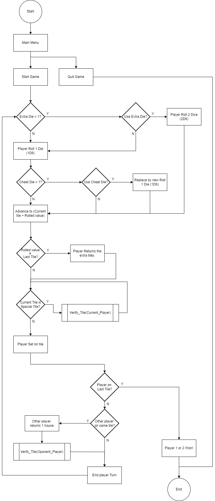

# Snakes and Ladders

Jogo de tabuleiro de corrida com dados implementado numa aplicação de consola .NET.

## Autoria

### João Inácio (a22102115)

- Implementação de funções para movimento do jogador
- Explicação da estrutura do programa

### Micael Teixeira (a22103816)

- Fluxogramas do programa
- Implementação do *game loop*

### Repositório

O repositório remoto utilizado encontra-se em https://github.com/Drackout/snakes-and-ladders.

## Arquitetura da solução

O código comecou por ser organizado com a criação do tabuleiro, seguido do seu preenchimento e da sua demonstração inicial para o jogador.
Após a criação do tabuleiro, seguiu-se a criação das funções que permitem ao jogador rolar os dados e de andarem para a frente e para trás no tabuleiro.

### Fluxograma da sequencia lógica do programa

### Função **Verify_Tile()**

## Referências

bla bla
